# FFS

I am a chartered accountant by current profession and qualified in 2022 under Chartered Accountants Ireland. Since then I have been working in finance in the Fin Tech industry but I have always toyed with the idea of starting my own business. This served as the inspiration for FFS - Freaney Financial Services.

My Goal was to create a website that would allow me to provide a range of services to potential clients. The initial offering would be preparation of monthly management accounts preparation however I would like to expand this to include other services in the future. In order to facilitate the process of providing these services, I needed to create a website that would allow me to simply share data with clients in a secure and efficient manner.

## Design

### Wire Frames

It was my intention to keep the design as simple as possible. Initially, i only envisaged a two or three page website. However, as I started to develop the project, I realised that I would need to create more pages and views to manage the functionality that I want to offer to users.

#### FFS Wireframes

- Home


- Management View
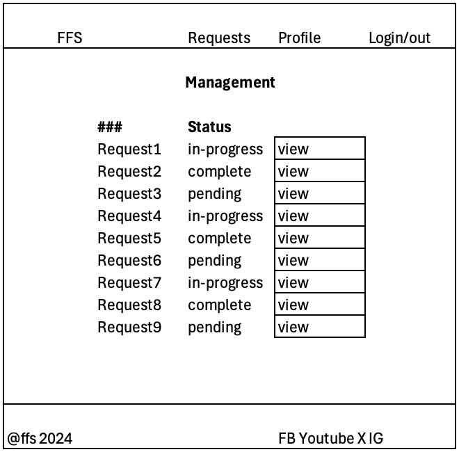

- Make Request
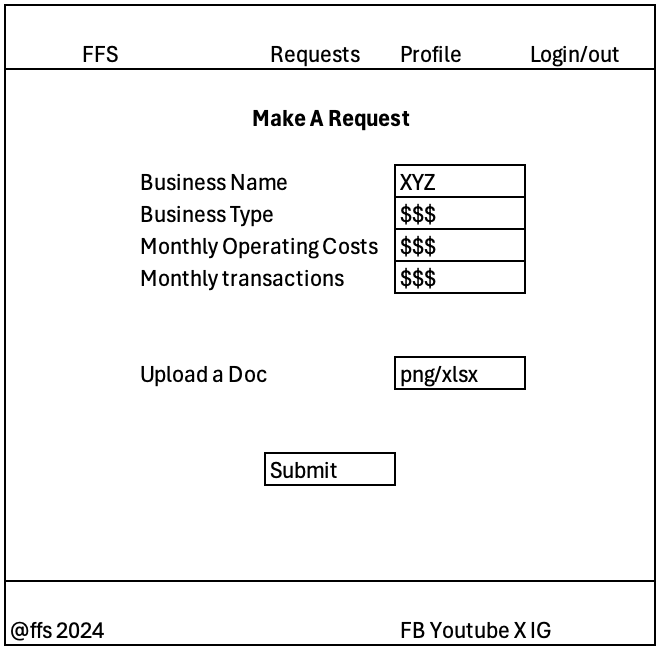

- Profile
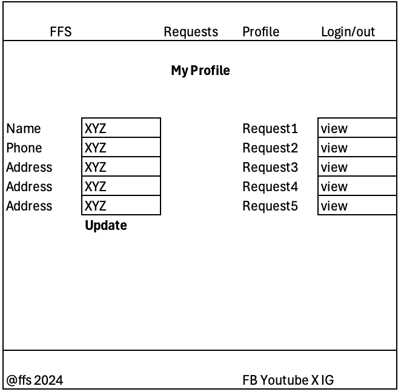

- Request Detail
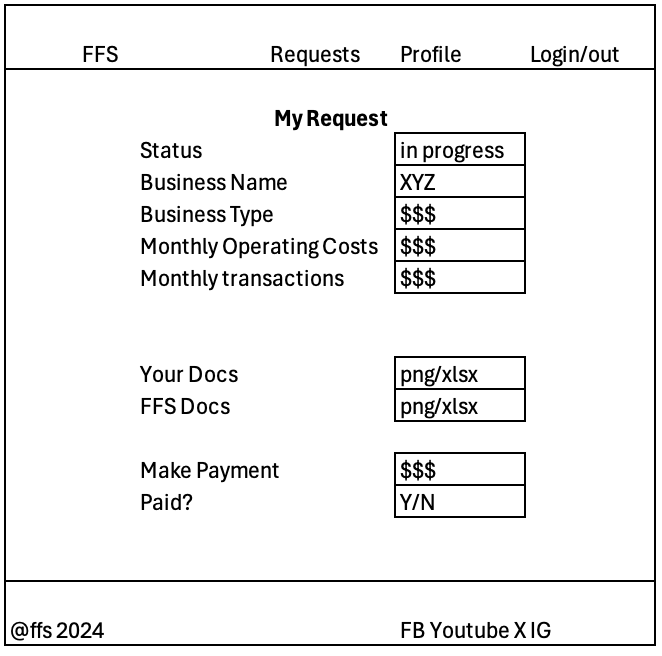

## Models

The creation of my wireframes provided a basis for the site's models. I have used Django's default user model. As i began to develop the project, I realised that I would need to create additional models to manage the different aspects of the site.

### Home App

#### NewsletterSubscriber Model

Description:
Manages newsletter subscriptions by storing unique email addresses and subscription dates.

I had not anticipated this model when drafting ERDs.

Fields:
1. email
   - Type: EmailField
   - Unique: True
   - Purpose: Stores subscriber's email address
   - Prevents duplicate subscriptions

2. date_added
   - Type: DateTimeField
   - Auto Now Add: True
   - Purpose: Automatically records subscription timestamp

String Representation:
Returns the subscriber's email address


### Profiles App

#### UserProfile Model

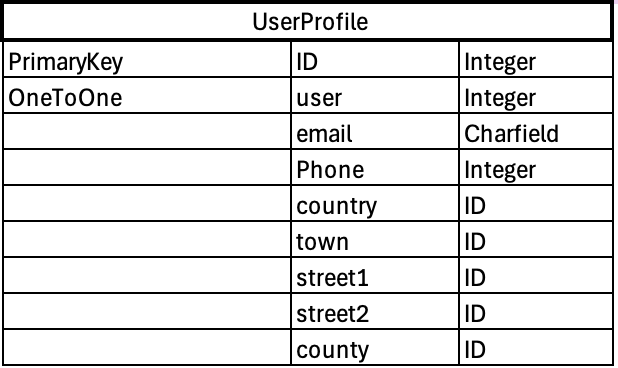

Description:
Extends the built-in Django User model to store additional user information and delivery details.

Fields:
1. user
   - Type: OneToOneField (User)
   - On Delete: CASCADE
   - Purpose: Links profile to Django User
   - Relationship: One-to-One

2. default_phone_number
   - Type: CharField
   - Max Length: 20
   - Null/Blank: True
   - Purpose: Stores contact number

3. default_country
   - Type: CountryField
   - Blank Label: 'Country *'
   - Null/Blank: True
   - Purpose: Stores country selection

4. default_postcode
   - Type: CharField
   - Max Length: 20
   - Null/Blank: True
   - Purpose: Stores postal code

5. default_town_or_city
   - Type: CharField
   - Max Length: 40
   - Null/Blank: True
   - Purpose: Stores town/city

6. default_street_address1
   - Type: CharField
   - Max Length: 80
   - Null/Blank: True
   - Purpose: Stores primary address

7. default_street_address2
   - Type: CharField
   - Max Length: 80
   - Null/Blank: True
   - Purpose: Stores secondary address

8. default_county
   - Type: CharField
   - Max Length: 80
   - Null/Blank: True
   - Purpose: Stores county/state

Special Functionality:
- Signal receiver automatically creates/updates profile when user is created
- All address fields are optional for flexibility

String Representation:
Returns the associated username


### Service Requests App

#### ServiceRequest Model

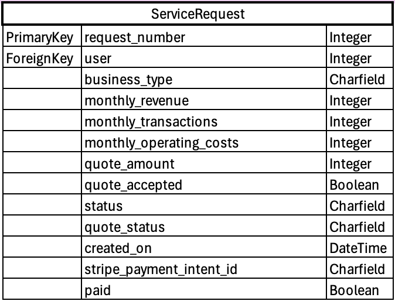

Description:
Core model handling business service requests, quotes, and payment processing.

Fields:
1. request_number
   - Type: UUIDField
   - Primary Key: True
   - Default: uuid.uuid4
   - Editable: False
   - Purpose: Unique identifier for requests

2. user
   - Type: ForeignKey (User)
   - On Delete: CASCADE
   - Purpose: Links request to user

3. business_type
   - Type: CharField
   - Max Length: 100
   - Purpose: Stores business category

4. monthly_revenue
   - Type: DecimalField
   - Max Digits: 10
   - Decimal Places: 2
   - Purpose: Stores monthly revenue figures

5. monthly_transactions
   - Type: IntegerField
   - Purpose: Stores transaction count

6. monthly_operating_costs
   - Type: DecimalField
   - Max Digits: 10
   - Decimal Places: 2
   - Purpose: Stores operating costs

7. quote_amount
   - Type: DecimalField
   - Max Digits: 10
   - Decimal Places: 2
   - Null/Blank: True
   - Purpose: Stores service quote amount

8. quote_accepted
   - Type: BooleanField
   - Default: False
   - Purpose: Tracks quote acceptance

9. status
   - Type: CharField
   - Max Length: 20
   - Choices: STATUS_CHOICES
   - Purpose: Tracks request status

10. quote_status
    - Type: CharField
    - Max Length: 20
    - Choices: QUOTE_STATUS_CHOICES
    - Default: 'pending'
    - Purpose: Tracks quote status

11. created_on
    - Type: DateTimeField
    - Auto Now Add: True
    - Purpose: Records creation timestamp

12. stripe_payment_intent_id
    - Type: CharField
    - Max Length: 255
    - Null/Blank: True
    - Purpose: Stores Stripe payment ID

13. is_paid
    - Type: BooleanField
    - Default: False
    - Purpose: Tracks payment status

Special Functionality:
- mark_as_paid() method updates payment status and request status


#### Document Model

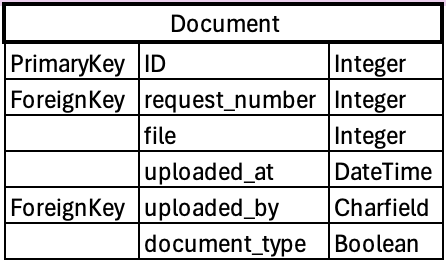

Description:
Manages document uploads and storage for service requests.

Fields:
1. service_request
   - Type: ForeignKey (ServiceRequest)
   - On Delete: CASCADE
   - Related Name: 'documents'
   - Purpose: Links document to service request

2. file
   - Type: FileField
   - Upload To: 'documents/'
   - Purpose: Stores uploaded file

3. is_bank_statement
   - Type: BooleanField
   - Default: True
   - Purpose: Identifies bank statements

4. uploaded_at
   - Type: DateTimeField
   - Auto Now Add: True
   - Purpose: Records upload timestamp

5. uploaded_by
   - Type: ForeignKey (User)
   - On Delete: SET_NULL
   - Null/Blank: True
   - Purpose: Tracks who uploaded document

6. document_type
   - Type: CharField
   - Max Length: 20
   - Choices: DOCUMENT_TYPE_CHOICES
   - Default: 'customer'
   - Purpose: Categorizes document type

Special Functionality:
- Automatically deletes old file when updated
- Custom save method handles file replacement

String Representation:
Returns document identifier with request number

## Model Relationships

### User Model (Django Built-in) Relationships

Django User Model is the central model with connections to:

1. UserProfile (One-to-One)
   - Each User has exactly one UserProfile
   - Created automatically via signal when User is created
   - Relationship defined in UserProfile model:
     user = models.OneToOneField(User, on_delete=models.CASCADE)

2. ServiceRequest (One-to-Many)
   - One User can have many ServiceRequests
   - Relationship defined in ServiceRequest model:
     user = models.ForeignKey(User, on_delete=models.CASCADE)

3. Document (One-to-Many)
   - One User can upload many Documents
   - Tracks document uploader
   - Relationship defined in Document model:
     uploaded_by = models.ForeignKey(User, on_delete=models.SET_NULL)


### ServiceRequest Model Relationships

ServiceRequest connects to:

1. User (Many-to-One)
   - Many ServiceRequests can belong to one User
   - Deleting a User deletes all their ServiceRequests (CASCADE)

2. Document (One-to-Many)
   - One ServiceRequest can have multiple Documents
   - Relationship defined in Document model:
     service_request = models.ForeignKey(ServiceRequest, on_delete=models.CASCADE)
   - Accessible via 'documents' related name:
     service_request.documents.all()


### Document Model Relationships

Document connects to:

1. ServiceRequest (Many-to-One)
   - Many Documents can belong to one ServiceRequest
   - Deleting a ServiceRequest deletes all associated Documents (CASCADE)

2. User (Many-to-One)
   - Many Documents can be uploaded by one User
   - If User is deleted, uploaded_by becomes NULL (SET_NULL)


### NewsletterSubscriber Model

- Standalone model with no relationships to other models
- Stores unique email addresses independently


### Key Points:
1. Deletion Behavior:
   - Deleting a User cascades to delete their Profile and ServiceRequests
   - Deleting a ServiceRequest cascades to delete its Documents
   - Deleting a User nullifies their Document uploads rather than deleting them

2. Access Patterns:
   - User → Profile: user.userprofile
   - User → ServiceRequests: user.servicerequest_set.all()
   - ServiceRequest → Documents: service_request.documents.all()
   - Document → ServiceRequest: document.service_request
   - Document → Uploader: document.uploaded_by

## Views

## FFS Views (`ffs/views.py`)
### `custom_404(request, exception)`
- Custom 404 error handler that renders a custom template when a page is not found
- Provides a better user experience than the default Django 404 page

## Home Views (`home/views.py`)
### `index(request)`
- Renders the main homepage of the site
- Simple view that returns the index template

### `newsletter_signup(request)`
- Handles newsletter subscription functionality
- Validates if email already exists in database
- Creates new subscription if email is unique
- Returns success/info messages
- Redirects back to previous page

## Profiles Views (`profiles/views.py`)
### `@login_required profile(request)`
- Protected view requiring user authentication
- Displays and handles updates to user profile information
- Features:
  - Retrieves user profile and service requests
  - Handles profile form submission and updates
  - Orders service requests by creation date (newest first)
  - Provides context for profile template including form and service requests

## Service Requests Views (`service_requests/views.py`)
### `@login_required create_service_request(request)`
- Handles creation of new service requests
- Features:
  - Processes both service request and document forms
  - Associates request with current user
  - Sets initial status to 'pending'
  - Handles file upload
  - Provides success messages

### `@login_required service_request_detail(request, request_number)`
- Displays detailed view of a specific service request
- Features:
  - Retrieves specific request for current user
  - Handles Stripe payment integration
  - Creates payment intent if quote is accepted but unpaid
  - Provides context for payment processing

### `@login_required service_request_list(request)`
- Displays list of all service requests for current user
- Filters requests to show only those belonging to current user

### `@login_required edit_service_request(request, request_number)`
- Handles editing of existing service requests
- Features:
  - Updates both request details and associated documents
  - Handles file replacement
  - Provides success messages
  - Validates user ownership

### `@login_required quote_response(request, request_number)`
- Processes user responses to quotes
- Features:
  - Handles quote acceptance/rejection
  - Updates request status accordingly
  - Validates quote status before processing

### `@login_required create_payment_intent(request, request_number)`
- Creates Stripe payment intent for processing payments
- Features:
  - Calculates payment amount
  - Creates Stripe payment intent
  - Includes debug logging
  - Handles errors

### `@login_required payment_success(request, request_number)`
- Handles successful payment processing
- Features:
  - Updates request payment status
  - Changes request status to 'in_progress'
  - Provides appropriate success messages

### `@login_required check_payment_status(request, request_number)`
- AJAX endpoint for checking payment status
- Returns JSON response with payment and request status

### `@login_required delete_service_request(request, request_number)`
- Handles service request deletion
- Features:
  - Validates user permissions
  - Provides confirmation page
  - Handles actual deletion
  - Includes success messages

## Management Views (`management/views.py`)
### `@staff_member_required management_dashboard(request)`
- Protected admin dashboard view
- Features:
  - Counts requests by status
  - Provides overview statistics

### `@staff_member_required service_request_management(request)`
- Admin view for managing service requests
- Features:
  - Filters requests by status
  - Sorts by date
  - Provides comprehensive request management

### `@staff_member_required service_request_detail(request, request_number)`
- Admin detailed view of service requests
- Features:
  - Updates request status and quote amounts
  - Handles document management
  - Provides success messages

### `@staff_member_required upload_owner_document(request, request_number)`
- Handles document uploads by staff
- Features:
  - Creates new document records
  - Associates documents with requests
  - Provides success/error messages

## Templates/Functionality

### Base.html

- Base.html is the base template for all pages and provides a consistent structure for the website.


 - Navbar
  - fixed position header with dark theme
  - conditional rendering of links based on user authentication status
  - links to Home, Management, Profiles, Service Requests and Sign In/Register
  - hamburger menu for authenticated users for better user experience


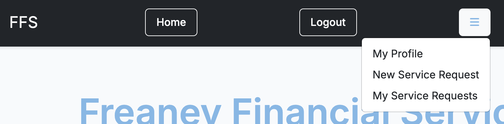

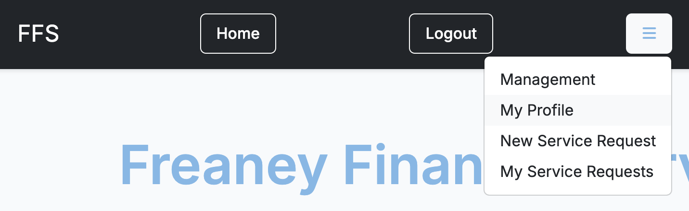

 - Messages
  - Django messages framework used to provide feedback to users


 - Footer
  - fixed position footer with dark theme
  - copyright information (for the purpose of the project)
  - social media links with accessibility attributes


### Custom 404.html
 
 - 404.html is the custom 404 error page.

 - extends base.html
 - 404 error page with simple explanation
 - return to homepage button

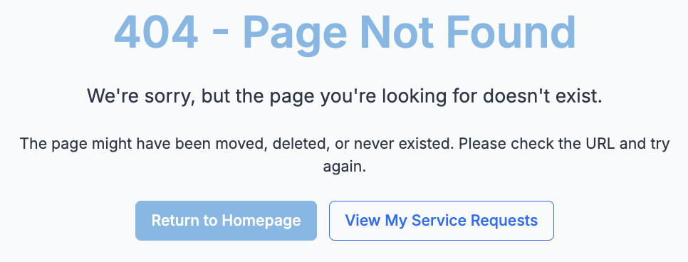

### Home App

### Index.html

- Index.html is the homepage of the site and its purpose is to provide a brief introduction to the company and services offered.

 - Main section
  - hero section with main heading and tagline

  - about us card with company introduction and three core principles
  - services card with brief introduction to the services offered
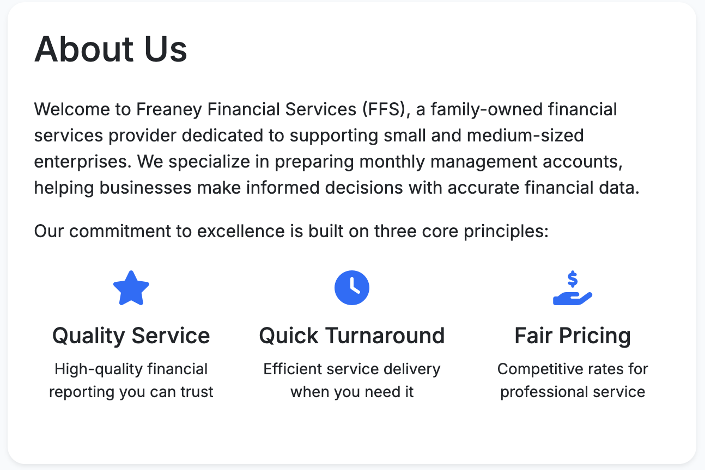
  - call to action button to request services
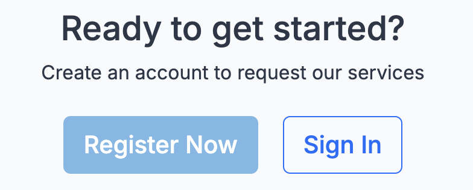
  - newsletter signup form for webmarketing


### Management App

- Management App is the admin dashboard for the site. This is where the user can view all service requests and manage them.

### Management_dashboard.html

- The management dashboard displays a count of service requests by status. It is intended that management can use this to assess their workload.
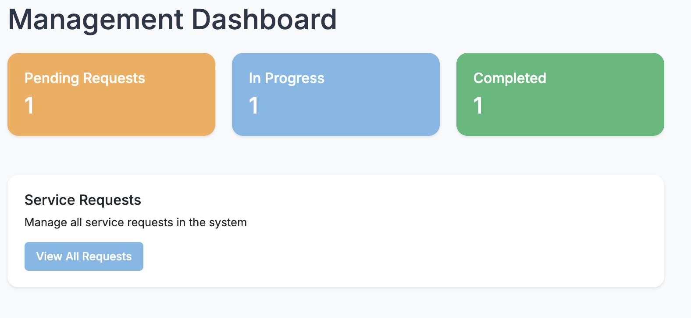

### service_request_management.html
- This is the management view of the service requests list. The list can be filtered by status and creation date.
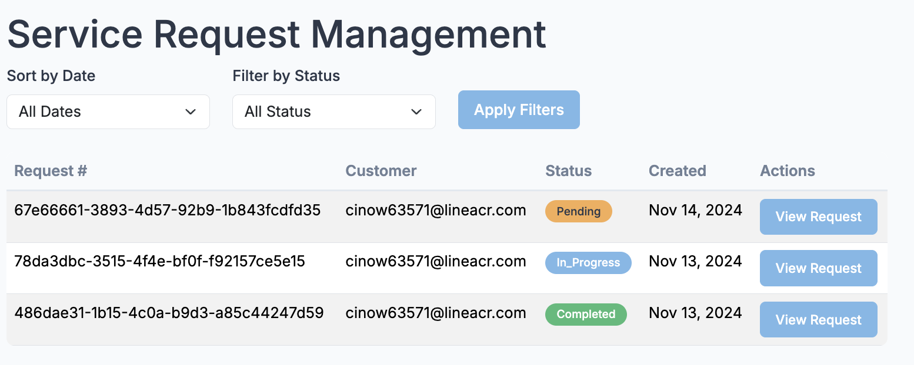

### service_request_detail.html
- This is the management view of the service request detail page. The page displays the request details and allows the management to update the status of the request, the quote amount, upload FFS documents and download customer documents.
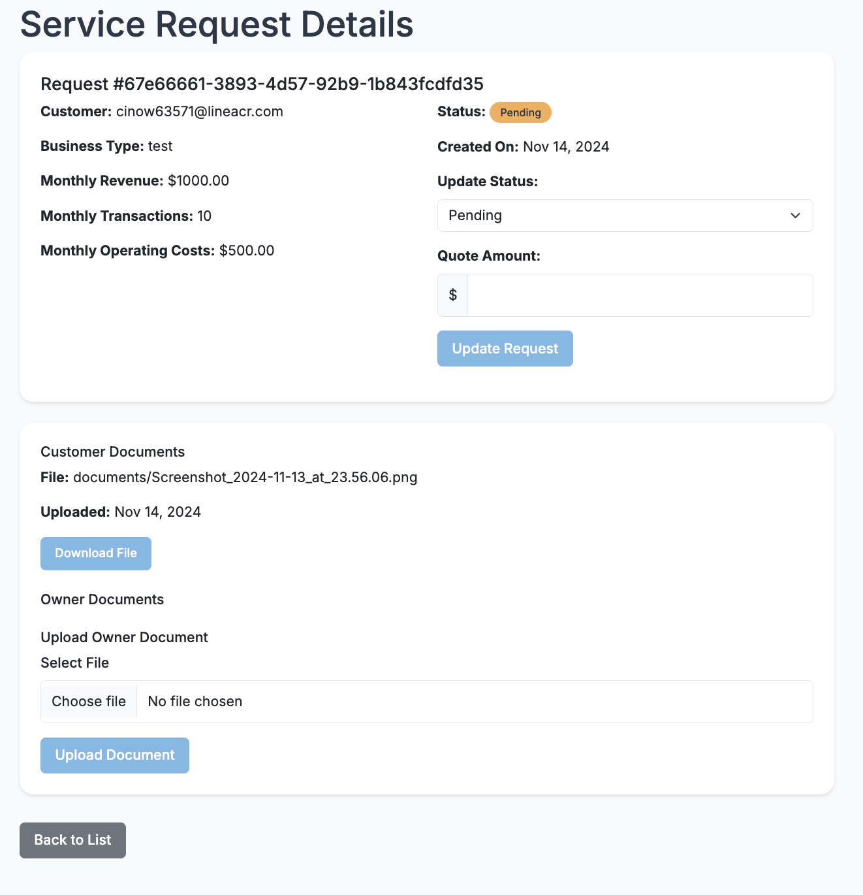


### Profiles App

- The profiles app is used to manage user profiles and access service requests.

### Profile.html
- The profile page allows the user to update their details and view their service requests.
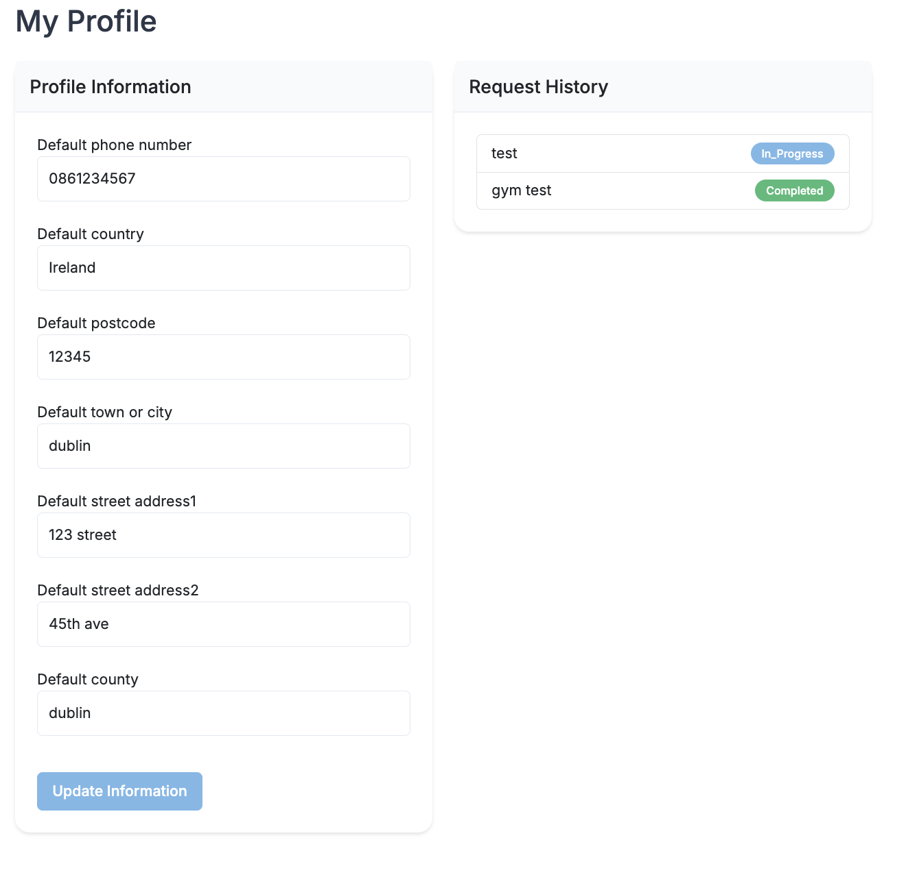

### Service_Requests App

- The service requests app is used to create andmanage service requests.

### create_service_request.html
- This is the user view of the service request creation page. The page allows the user to input their details and upload a document.
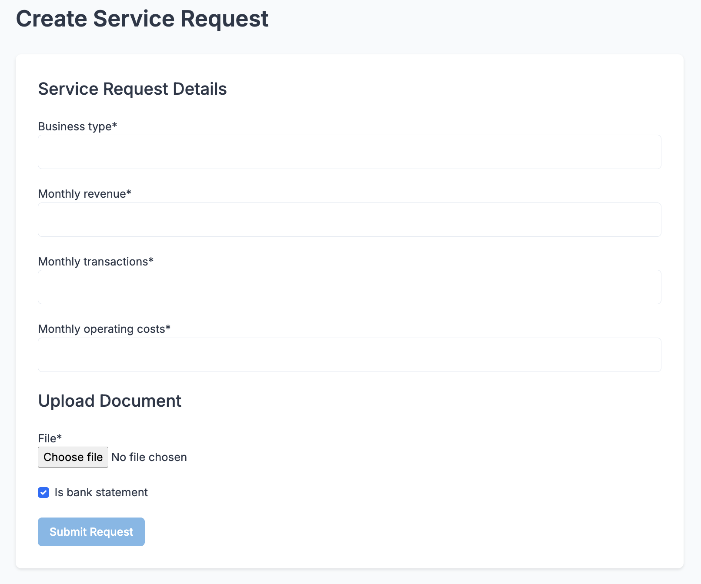

### edit_service_request.html
- This is the user view of the service request edit page. The page allows the user to update their details and upload a document.
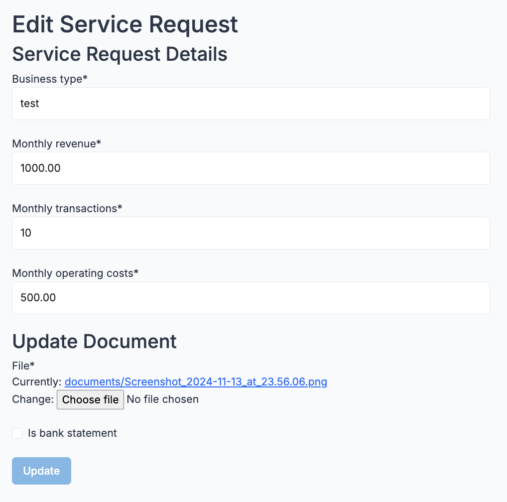

### service_request_list.html
- This is the user view of the service request list page. The page displays the user's service requests and allows them to view the status of each request.
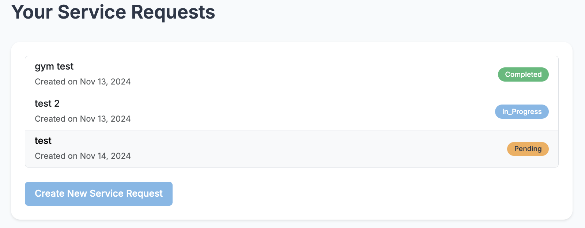

### service_request_detail.html
- This is the user view of the service request detail page. The page displays the request details and allows the user to make payment, download the FFS documents and view the status of the request.
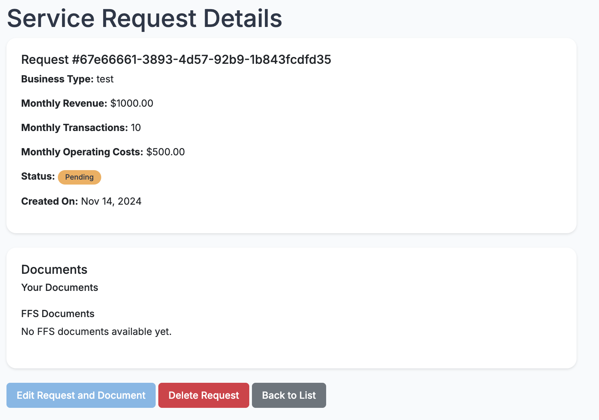

### request_confirm_delete.html
- This is the user view of the service request delete confirmation page. The page allows the user to confirm the deletion of the request.
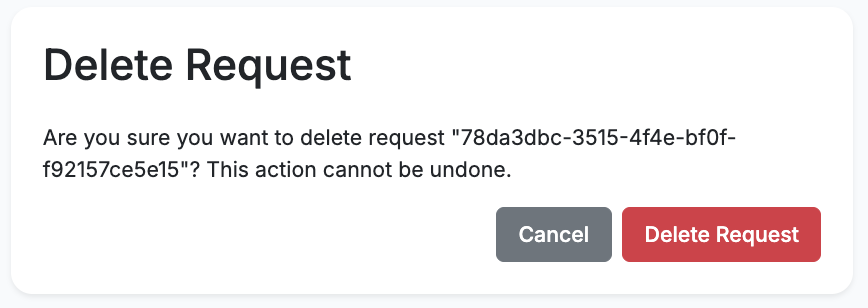


## Authentication

The project uses Django Allauth for authentication and account management. This provides:

- Secure user authentication
- User registration with email verification
- Password reset functionality
- Robust account management

The authentication templates have been customized to match the site's styling while maintaining Allauth's secure functionality.

### Sign In
- The sign in page allows the user to sign in to their account.
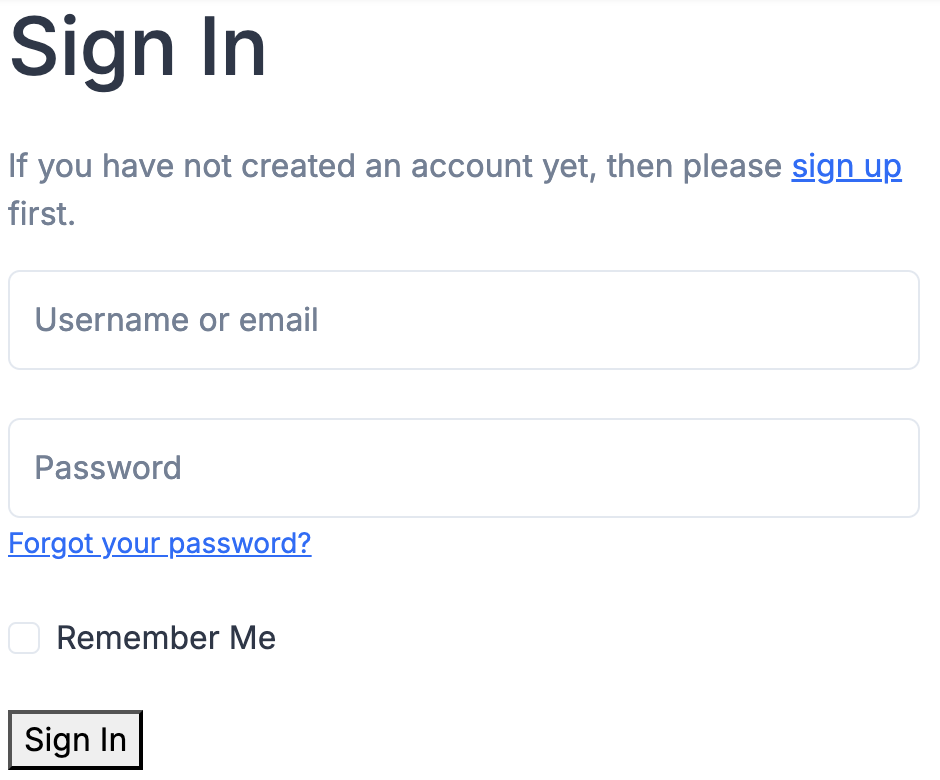

### Sign Up
- The sign up page allows the user to create an account.
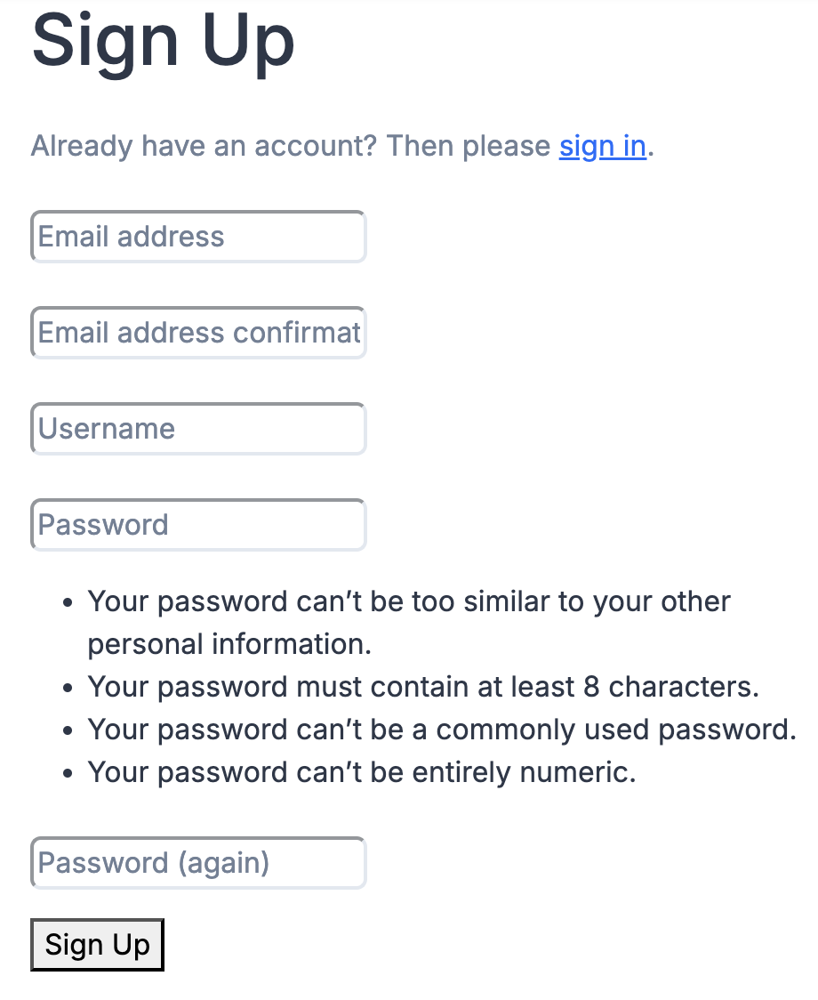

### Password Reset
- The password reset page allows the user to reset their password.
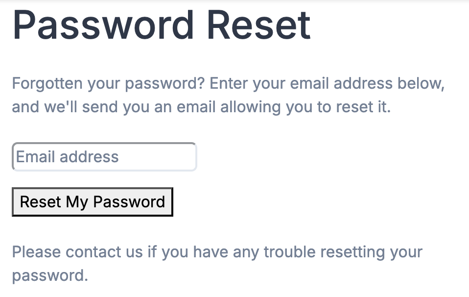

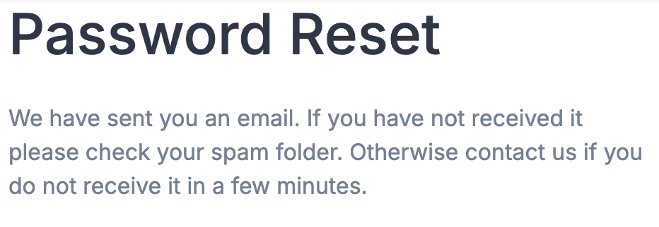

### Sign Out
- The sign out page allows the user to sign out of their account.
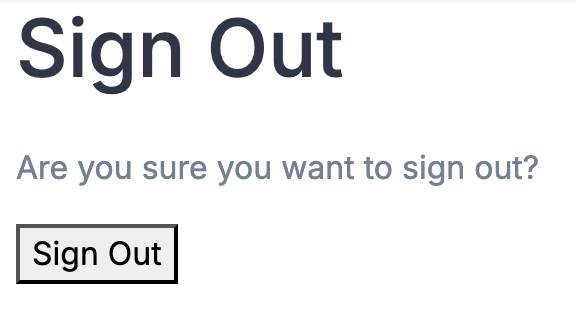


## E-Commerce Functionality

## Frontend Implementation (stripe_element.js)

### Initial Setup and DOM Checks

```javascript
document.addEventListener('DOMContentLoaded', function() {
const paymentForm = document.getElementById('payment-form');
const cardElement = document.getElementById('card-element');
if (paymentForm && cardElement) {
console.log('Stripe Public Key:', stripePublicKey);
```

This section:
- Ensures DOM is fully loaded before initialization
- Checks for payment form elements
- Validates required Stripe keys are present

### Stripe Elements Configuration

```javascript
const stripe = Stripe(stripePublicKey);
const elements = stripe.elements();
const card = elements.create('card');
card.mount('#card-element');
```

This section:
- Configures Stripe elements
- Creates card element
- Mounts card element to the DOM

### Real-time Card Validation

```javascript
card.on('change', function(event) {
const displayError = document.getElementById('card-errors');
if (event.error) {
displayError.textContent = event.error.message;
} else {
displayError.textContent = '';
}
});
```

Provides:
- Instant feedback on card input
- Validation for:
  - Card number format
  - Expiry date validity
  - CVC format
  - Card type recognition
- Real-time error messages

### Payment Form Submission

```javascript
paymentForm.addEventListener('submit', async function(e) {
e.preventDefault();
paymentButton.disabled = true;
try {
// Create Payment Intent
const response = await fetch(createPaymentIntentUrl, {
method: 'POST',
headers: {
'Content-Type': 'application/json',
'X-CSRFToken': csrfToken
}
});
const data = await response.json();
if (data.error) {
handleError(data.error);
return;
}
// Confirm Payment
const { error, paymentIntent } = await stripe.confirmCardPayment(
data.clientSecret,
{
payment_method: { card: card }
}
);
```

Handles:
- Form submission prevention
- Double-submission protection
- Payment Intent creation
- CSRF protection
- Error catching and handling

### Comprehensive Error Handling

```javascript
if (error) {
console.error('Payment error:', error);
const errorDiv = document.getElementById('card-errors');
errorDiv.textContent = error.message;
errorDiv.classList.add('alert', 'alert-danger');
paymentButton.disabled = false;
} else {
if (paymentIntent.status === 'succeeded') {
handleSuccess(data.requestNumber);
} else {
handleUnexpectedStatus(paymentIntent.status);
}
}
```

Manages:
- Card processing errors
- Network failures
- Server response errors
- Unexpected payment states
- User feedback display

## Webhook Implementation (webhooks.py)

### Endpoint Configuration and Decorators

```python
@require_POST
@csrf_exempt
def webhook(request):
"""Listen for webhooks from Stripe"""
wh_secret = settings.STRIPE_WEBHOOK_SECRET
stripe.api_key = settings.STRIPE_SECRET_KEY
```

Purpose:
- Restricts to POST requests only
- Bypasses CSRF for Stripe webhooks
- Configures Stripe credentials

### Webhook Data Extraction and Verification

``` python
payload = request.body
sig_header = request.META['HTTP_STRIPE_SIGNATURE']
event = None
try:
event = stripe.Webhook.construct_event(
payload, sig_header, wh_secret
)
except ValueError as e:
" # Invalid payload format" 
return HttpResponse(content=str(e), status=400)
except stripe.error.SignatureVerificationError as e:
" # Invalid signature" 
return HttpResponse(content=str(e), status=400)
except Exception as e:
" # Generic error handling" 
return HttpResponse(content=str(e), status=400)
```

Handles:
- Raw webhook payload extraction
- Signature header retrieval
- Event construction
- Three levels of error catching:
  1. Malformed payload
  2. Invalid signature
  3. Unexpected errors

### Event Routing System

```python
handler = StripeWH_Handler(request)
event_map = {
'payment_intent.succeeded': handler.handle_payment_intent_succeeded,
'payment_intent.payment_failed': handler.handle_payment_intent_payment_failed,
}
event_type = event['type']
event_handler = event_map.get(event_type, handler.handle_event)
response = event_handler(event)
```

Provides:
- Handler instance creation
- Event type mapping
- Fallback handling
- Response processing

## Webhook Handler Implementation (webhook_handler.py)

### Handler Class Initialization

```python
class StripeWH_Handler:
"""Handle Stripe webhooks"""
def init(self, request):
self.request = request
```

Purpose:
- Creates handler instance
- Stores request context
- Enables request access in handlers

### Generic Event Handler


```python
def handle_event(self, event):
"""Handle generic event"""
return HttpResponse(content=str(event), status=200)
``` 

Manages:
- Unknown event types
- Logging opportunities
- Default responses

### Successful Payment Handler

```python
def handle_payment_intent_succeeded(self, event):
"""Handle successful payment confirmation"""
intent = event.data.object
request_number = intent.metadata.request_number
try:
# Locate service request
service_request = ServiceRequest.objects.get(
request_number=request_number,
stripe_payment_intent_id=intent.id
)
# Update payment status
service_request.mark_as_paid()
print(f"Payment confirmed for request {request_number}")
return HttpResponse(
content=f'Webhook received: {event["type"]} | SUCCESS: Payment confirmed',
status=200)
except ServiceRequest.DoesNotExist:
print(f"Service request not found: {request_number}")
return HttpResponse(
content=f'Webhook received: {event["type"]} | ERROR: Service request not found',
status=404)
except Exception as e:
return HttpResponse(
content=f'Webhook received: {event["type"]} | ERROR: {str(e)}',
status=500)
```

Handles:
- Payment intent extraction
- Request number retrieval
- Database record location
- Payment status updates
- Error scenarios:
  - Missing records
  - Database errors
  - General exceptions
- Logging and debugging
- Status responses

### Failed Payment Handler

```python
def handle_payment_intent_payment_failed(self, event):
"""Handle failed payment notification"""
return HttpResponse(
content=f'Webhook received: {event["type"]}',
status=200)
```

Manages:
- Failed payment logging
- Error notification opportunities
- Status acknowledgment

## Helper Methods and Utilities

### Payment Status Update

```python
def mark_as_paid(self):
"""Update service request payment status"""
self.is_paid = True
self.paid_at = timezone.now()
self.save()
```

Handles:
- Payment status flag
- Timestamp recording
- Database updates

### Error Handling Utilities

```python
def handleError(error):
"""Process and display error messages"""
console.error('Error:', error);
const errorDiv = document.getElementById('card-errors');
errorDiv.textContent = error.message;
errorDiv.classList.add('alert', 'alert-danger');
paymentButton.disabled = false;
```

Provides:
- Error logging
- User feedback
- UI updates
- Button state management

## Complete System Integration

### Payment Flow
1. User submits payment form
2. Frontend creates Payment Intent
3. Card payment confirmed with Stripe
4. Webhook received from Stripe
5. Payment status verified
6. Database updated
7. Success response sent

### Error Handling Flow
1. Error occurs (frontend/backend)
2. Error caught and logged
3. Appropriate handler triggered
4. User notified if applicable
5. System state maintained
6. Response sent to

### Security Measures
1. CSRF protection
2. Signature verification
3. Error handling
4. Database validation
5. Status verification
6. Duplicate prevention

### Monitoring and Debugging
1. Console logging
2. Server-side prints
3. Error tracking
4. Status monitoring
5. Response logging
6. Database state tracking


## Business Model / Marketing Strategy

### Business Model

A small accounting firm's business model typically revolves around providing essential financial services to individuals, small businesses, and sometimes larger clients.

Key Aspects of the Business Model
1. Target Market: Small to medium-sized businesses, freelancers, startups, and individuals needing tax or financial services.
2. Service Offerings: Bookkeeping, tax preparation, financial statements, auditing, and consulting. Initially FFS will offer bookkeeping / monthly management accounts preparation.
3. Revenue Streams: Fees for individual services, bundled service packages, and potentially subscription-style pricing for regular bookkeeping or payroll services. Initially FFs will be charging customers on a per service basis.
4. Value Proposition: The provision of high-quality, reliable financial statements with a quick turnaround time and fair pricing..
5. Client Retention: Building strong relationships with clients to ensure ongoing service needs, word-of-mouth referrals, and positive online reviews.

## Newsletter Marketing Strategy

 - A newsletter can educate, inform, and keep clients engaged with the firm's offerings. Some strategies include:

1. Monthly Financial Tips: Each newsletter can provide valuable financial advice tailored to the target market. For example, "5 Tax Deductions Small Business Owners Overlook" or "How to Prepare for Tax Season."

2. Updates on Tax Laws and Financial Regulations: Tax laws change frequently, and businesses value proactive updates. The firm can build trust by alerting clients to important changes and suggesting ways to adapt.

3. Client Success Stories and Case Studies: Share anonymized success stories showing how the firm’s expertise helped solve a client’s problem. For instance, "How We Helped a Local Retailer Save 15% on Taxes" can showcase the firm’s impact.

4. Seasonal Reminders: Reminders for important tax dates or bookkeeping milestones (e.g., end-of-year preparation, quarterly filings) can help clients stay on track. These can position the firm as a reliable and attentive partner.

5. Special Offers and Discounts: Including limited-time offers, such as a discount on tax preparation services for new clients or referrals, can encourage engagement and expand the client base.

I am noting that in the Project Portfolio 5 course materials a free version of mailchimp is used. As there is no longer a free version of mailchimp I have used a NewsletterSubscriber model which is linked to my database. I am assuming that this will not affect my grade as I think it is unreasonable to expect students to pay for additional services over and above tuition fees.

### Facebook mockup


## Unfixed Bugs

- I am unable to get static files pushed to S3 on my deployed site. I have tried several times and have been unable to resolve the issue. I have used the instructions from the Code Institute walkthrough project as well looking at documentation on AWS. Unfortunately, This means that the user and management will not be able to upload and download their documents as desired. I understand that this is not ideal, however, I believe that the site is sufficiently functional to facilitate a platform for a small accounting company to manage customers and take payment for services while sharing documents with the customer over email. This has also affected loading of stylesheets and can cause an error in the console relating to verifying the stylesheet. After performing rigorous testing, this doesn't seem to have affected the integration with Stripe and processing test payments has been successful.  

## Additional Features

- Implement static file storage on AWS S3.
- Implement testimonials section to allow customers to provide reviews.
- Add a question and answer section in the request detail page to allow users and management to interact and communicatewithin the site.
- Add invoice creation and management to the management dashboard and allow users to view and download invoices. Currently it could be assumed that invoices would be shared with the customer over email.


# Testing

## Manual Testing Table

| Action    | Expectation | Result | 
|-----------|:-------------------:|----------|
| Internal Link tests | directed to the intended location | All Pass |
| External Link tests | directed to the intended location | All Pass |
| Button hover tests | change colour when hovered over | All Pass |
| Click 'Home' link | directed to Index.html | Pass |
| User Registration | form submits and creates new account | Pass |
| Login with valid credentials | successful login and redirect to home | Pass |
| Login with invalid credentials | error message displayed | Pass |
| Password Reset Request | email sent with reset instructions | Pass |
| Newsletter Signup | form submits and success message shown | Pass |
| Create Service Request | form submits and request created | Pass |
| Upload Document | file uploads and appears in request | Pass |
| Delete Service Request | confirmation prompt and successful deletion | Pass |
| Profile Update | form saves new information successfully | Pass |
| Stripe Payment | test payment processes successfully | Pass |
| Responsive Design (Mobile) | content adjusts to screen size | Pass |
| Responsive Design (Tablet) | content adjusts to screen size | Pass |
| Form Validation | error messages show for invalid inputs | Pass |
| Logout | user session ends and redirects to home | Pass |
| Management Dashboard Access | restricted to staff users only | Pass |
| 404 Page | shows custom error page for invalid URLs | Pass |

## Automated Tests Documentation

## Profile Tests

### Forms (profiles/tests/test_forms.py)

### test_form_fields_are_explicit_in_form_metaclass
```Test that the correct fields are excluded in the form```
- Validates form metaclass configuration
- Ensures 'user' field is properly excluded

### test_form_fields_are_present
```Test that the expected fields are present in the form```
- Verifies presence of all required profile fields
- Validates all address and contact fields exist

### Views (profiles/tests/test_views.py)

### test_profile_view_redirect_if_not_logged_in
```Test profile view redirects if user is not logged in```
- Verifies unauthorized access handling
- Confirms redirect to login page

### test_profile_view_GET
```Test GET request to profile view```
- Validates successful profile page load
- Verifies correct template usage
- Confirms presence of form and service requests in context

### test_profile_view_POST_valid_data
```Test POST request with valid form data```
- Tests profile update functionality
- Verifies successful data submission
- Confirms success message display

### test_profile_view_displays_service_requests
```Test that service requests are displayed in profile```
- Validates service request display
- Verifies correct user-request association

### test_profile_view_POST_invalid_data
```Test POST request with invalid form data```
- Tests form validation for invalid input
- Verifies error handling for invalid data

### test_profile_view_POST_empty_data
```Test POST request with empty data```
- Validates handling of empty form submission
- Confirms optional field behavior

### test_service_requests_ordered_by_created_on
```Test that service requests are displayed in correct order```
- Verifies chronological ordering
- Confirms newest-first sorting

### test_on_profile_page_context
```Test that on_profile_page context is True```
- Validates context variable setting
- Verifies page identification

### test_profile_view_with_no_service_requests
```Test profile view when user has no service requests```
- Tests empty state handling
- Verifies correct display with no requests

### Models (profiles/tests/test_models.py)

### test_profile_str_method
```Test the string representation of the UserProfile model```
- Validates profile string representation
- Verifies username display

### test_profile_created_on_user_creation
```Test that a UserProfile is automatically created when a User is created```
- Confirms automatic profile creation
- Verifies user-profile relationship

### test_profile_fields_are_optional
```Test that all profile fields except user are optional```
- Validates optional field configuration
- Verifies default values for all fields

## Service Request Tests

### Forms (service_requests/tests/test_forms.py)

### test_service_request_form_valid_data
```Test form with valid data```
- Validates form processing with correct data
- Verifies successful form validation

### test_service_request_form_invalid_data
```Test form with missing required fields```
- Tests form validation with invalid data
- Verifies error handling for missing fields
- Validates decimal field validation

### test_document_form_valid_data
```Test document form with valid file```
- Validates file upload functionality
- Verifies form processing with valid PDF

### test_document_form_invalid_file_type
```Test document form with invalid file type```
- Tests file type validation
- Verifies rejection of invalid file types

### Views (service_requests/tests/test_views.py)

### test_create_service_request_get
```Test GET request for service request creation```
- Validates form display
- Verifies template usage

### test_create_service_request_post
```Test POST request for service request creation```
- Tests request creation with valid data
- Verifies file upload handling
- Confirms successful submission

### test_service_request_detail
```Test service request detail view```
- Validates detail page display
- Verifies correct context data

### test_service_request_list
```Test service request listing```
- Tests request list display
- Verifies correct template usage
- Validates context data

### test_edit_service_request
```Test service request editing```
- Validates update functionality
- Verifies data persistence
- Tests redirect behavior

### test_quote_response
```Test quote response handling```
- Tests quote status updates
- Verifies response processing

### test_delete_service_request
```Test service request deletion```
- Validates deletion functionality
- Verifies proper cleanup

### test_edit_service_request_unauthorized
```Test unauthorized edit attempts```
- Validates access control
- Verifies 404 response for unauthorized users

### test_quote_response_invalid_status
```Test invalid quote response handling```
- Tests invalid status validation
- Verifies status remains unchanged

### test_delete_service_request_unauthorized
```Test unauthorized deletion attempts```
- Validates deletion restrictions
- Verifies redirect behavior

### test_views_require_login
```Test login requirements for views```
- Validates authentication requirements
- Verifies redirect to login

### test_edit_nonexistent_service_request
```Test editing non-existent requests```
- Validates 404 response
- Tests error handling

### test_quote_response_already_processed
```Test quote response for processed quotes```
- Validates quote status protection
- Verifies unchanged status

### test_create_service_request_invalid_data
```Test invalid service request creation```
- Tests form validation
- Verifies error handling
- Validates file type restrictions

### test_edit_service_request_invalid_data
```Test invalid service request editing```
- Tests form validation during edit
- Verifies error handling
- Validates context data

### test_service_request_list_empty
```Test empty service request list```
- Validates empty state handling
- Verifies zero-request display

### test_service_request_detail_context
```Test detail view context```
- Validates context data
- Verifies Stripe key presence

### test_delete_service_request_get
```Test delete confirmation page```
- Validates confirmation template
- Tests GET request handling

### test_delete_service_request_staff
```Test staff deletion privileges```
- Validates staff permissions
- Verifies successful deletion

### test_edit_service_request_get
```Test edit form display```
- Validates form context
- Verifies template usage

### test_create_service_request_invalid_document
```Test invalid document upload```
- Tests document validation
- Verifies error handling


## Service Request Models Tests (service_requests/tests/test_models.py)

### test_mark_as_paid
```Test mark_as_paid method updates status correctly```
- Validates payment status update
- Verifies status change to 'in_progress'

### test_document_str_representation
```Test the string representation of Document```
- Validates document string format
- Verifies request number inclusion

### test_document_file_update
```Test that old file is deleted when updating document```
- Tests file replacement functionality
- Verifies old file deletion
- Validates new file storage

## Payment Tests (service_requests/tests/test_payment_views.py)

### test_create_payment_intent_success
```Test successful payment intent creation```
- Validates Stripe API integration
- Verifies client secret generation
- Tests metadata handling

### test_create_payment_intent_unauthorized
```Test unauthorized payment intent creation```
- Validates authentication requirements
- Verifies redirect to login

### test_create_payment_intent_invalid_request
```Test payment intent creation with invalid requests```
- Tests validation of quote status
- Verifies error handling for invalid requests

### test_payment_success_view
```Test the payment success view```
- Validates success redirect
- Verifies detail page navigation

### test_check_payment_status
```Test the payment status check endpoint```
- Tests payment status tracking
- Validates JSON response format
- Verifies status updates

### test_create_payment_intent_wrong_user
```Test creating payment intent for another user's request```
- Validates user authorization
- Verifies access control

### test_payment_success_not_paid
```Test payment success view when payment is not confirmed```
- Tests pending payment handling
- Verifies message display

### test_payment_success_already_paid
```Test payment success view for confirmed payments```
- Validates paid status handling
- Verifies success message

### test_check_payment_status_unauthorized
```Test check payment status with wrong user```
- Tests unauthorized access handling
- Verifies 404 response

### test_check_payment_status_nonexistent
```Test check payment status with non-existent request```
- Validates non-existent request handling
- Verifies error response

### test_create_payment_intent_stripe_error
```Test handling of Stripe API errors```
- Tests Stripe error handling
- Validates error response format

### test_payment_success_invalid_request
```Test payment success view with invalid request number```
- Tests non-existent request handling
- Verifies 404 response

## Management Tests (management/tests/test_views.py)

### test_management_dashboard_view
```Test access control for management dashboard```
- Validates staff-only access
- Tests redirect for non-staff users
- Verifies successful access for staff
- Confirms correct template usage

### test_service_request_management_view
```Test service request management functionality```
- Validates request listing display
- Tests status filtering functionality
- Verifies staff-only access
- Confirms correct template usage
- Tests request count accuracy

### test_service_request_detail_view
```Test service request detail functionality```
- Validates detail view access control
- Tests context data accuracy
- Verifies staff-only access
- Confirms request data display

### test_upload_owner_document_view
```Test document upload functionality```
- Validates file upload process
- Tests access control for uploads
- Verifies successful file storage
- Confirms error handling for invalid uploads

### test_service_request_detail_post
```Test service request update functionality```
- Validates status update process
- Tests quote amount modifications
- Verifies data persistence
- Confirms validation handling

### test_management_dashboard_counts
```Test dashboard statistics accuracy```
- Validates request counting by status
- Tests pending request count
- Verifies in-progress request count
- Confirms completed request count

### test_service_request_management_date_ordering
```Test date-based request ordering```
- Validates chronological sorting
- Tests newest-first ordering
- Verifies oldest-first ordering
- Confirms sort preference handling

### test_success_messages
```Test system feedback messages```
- Validates success message display
- Tests message content accuracy
- Verifies message integration

### test_document_upload_validation
```Test document upload validation```
- Validates file type restrictions
- Tests file size limits
- Verifies successful upload process
- Confirms error handling

### Validator Testing
- __HTML__
  - No errors returend through W3C validator.

- __CSS__
  - No errors returned through jigsaw validator.

- __JS__
  - No errors returned through jshint validator.

- __Python__
  - No errors returned through PEP8 CI Python Linter.


## Deployment

I have used Heroku for my deployed site. Deployment procedures are as follows:

### Fork the Repository
1. Navigate to the [repository](https://github.com/freaney-financial-services/ffs)
2. Click the "Fork" button in the top right corner
3. Select your GitHub account as the destination

### Clone the Repository
1. Navigate to the [repository](https://github.com/freaney-financial-services/ffs)
2. Click the "Code" button
3. Select HTTPS and copy the provided URL
4. Open your terminal
5. Navigate to your desired directory
6. Run `git clone <URL>` with your copied URL

### Deploy to Heroku
1. Create a new Heroku app
2. In Heroku Settings, add the following Config Vars:
   - `DATABASE_URL`: Your PostgreSQL database URL
   - `SECRET_KEY`: Your Django secret key
   - `STRIPE_PUBLIC_KEY`: Your Stripe public key
   - `STRIPE_SECRET_KEY`: Your Stripe secret key
   - `STRIPE_WH_SECRET`: Your Stripe webhook secret
   - `AWS_ACCESS_KEY_ID`: Your AWS access key
   - `AWS_SECRET_ACCESS_KEY`: Your AWS secret key
   - `USE_AWS`: Set to True
   - `EMAIL_HOST_PASS`: Your email password
   - `EMAIL_HOST_USER`: Your email address

3. In your project:
   - Create a `requirements.txt`: `pip freeze > requirements.txt`
   - Create a `Procfile`: `web: gunicorn your_project_name.wsgi:application`
   - Ensure `DEBUG = False` in settings.py
   - Add Heroku app URL to `ALLOWED_HOSTS`

4. Deploy:
   - Connect GitHub repository to Heroku
   - Enable automatic deploys (optional)
   - Deploy main branch

The live site can be found here: [FFS](https://ffs-freaney-financial-services-10d1650d84d3.herokuapp.com/)